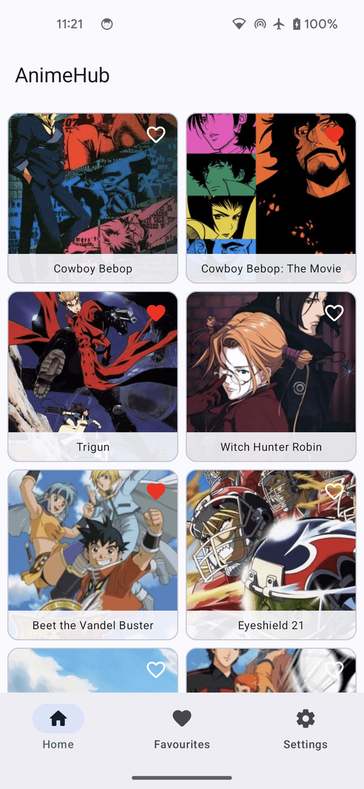
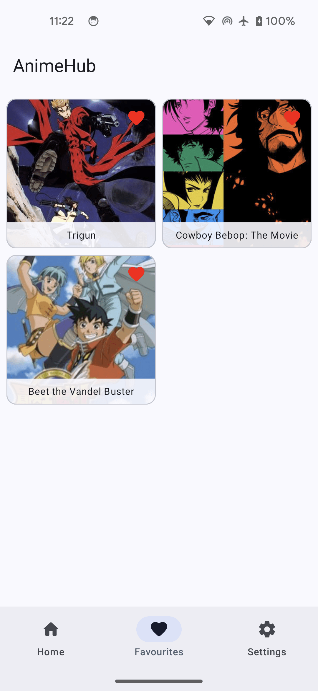
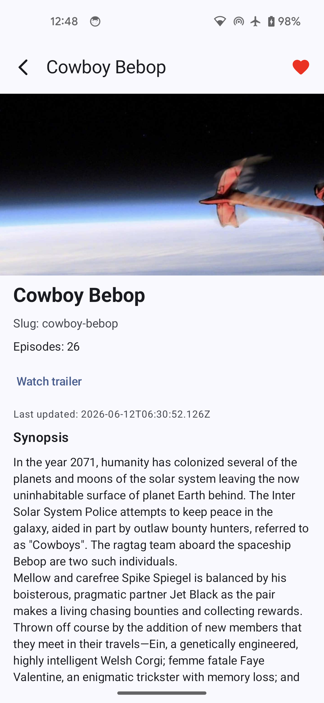

# AnimeHub

[](https://kotlinlang.org)
[](https://developer.android.com/jetpack/compose)
[](LICENSE)

A modern **anime discovery** Android app powered by the [Kitsu API](https://kitsu.docs.apiary.io/). Browse trending anime, view rich details, manage favourites with offline persistence, and customize the app theme — all built with modular **Clean Architecture**.

**Author:** [Sohaib Ahmed](https://github.com/itssohaibahmed) · [Portfolio](https://itssohaibahmed.github.io)

---

## Features

<p align="center">
  
  
  
</p>

- **Home feed** — Paging 3 infinite scroll, pull-to-refresh, offline Room cache, favourite toggle on each card
- **Anime details** — Cover art, synopsis, episode count, slug, trailer link, pull-to-refresh, favourite toggle in toolbar
- **Favourites** — Dedicated tab with persisted grid, tap to open details, remove from favourites anytime
- **Settings** — System / Light / Dark theme, rate app, feedback, share, and social links
- **Offline-first** — Home list and details observe Room; network syncs in the background
- **Navigation** — Splash → dashboard tabs → details overlay with back stack

---

## Architecture

Multi-module **Clean Architecture** with feature modules and shared core layers:

```
app
├── feature-splash, feature-dashboard, feature-home
├── feature-anime-details, feature-favourites, feature-settings
├── data, domain
└── core-network, core-database, core-design, core-common
```

| Layer | Responsibility |
|-------|----------------|
| **Presentation** | Compose UI, ViewModels (MVI), navigation |
| **Domain** | Use cases, repository contracts, models |
| **Data** | Repository implementations, Kitsu API, Room, DataStore |
| **Core** | Network, database, design system, shared utilities |

### Favourites data flow

Favourites are stored in a dedicated Room table (`table_favourite_anime`) with a snapshot of each anime (id, title, poster). This keeps favourites intact even when the home feed cache is refreshed.

```
UI Intent → ViewModel → ToggleFavouriteAnimeUseCase → FavouriteRepository → Room
```

---

## Tech stack

- Kotlin, Coroutines, Flow
- Jetpack Compose, Material 3
- Paging 3, Room, DataStore
- Retrofit / OkHttp (Kitsu REST API)
- Koin (DI)
- Modular Gradle (Kotlin DSL)

---

## Getting started

### Prerequisites

- Android Studio (latest stable)
- JDK 17+
- Android SDK 34+

### Run

```bash
git clone https://github.com/itssohaibahmed/AnimeHub.git
cd AnimeHub
```

Open in Android Studio → sync Gradle → run `app`.

---

## Documentation

Architecture overview: [`docs/Architecture.md`](docs/Architecture.md)

---

## License

MIT — see [LICENSE](LICENSE).
